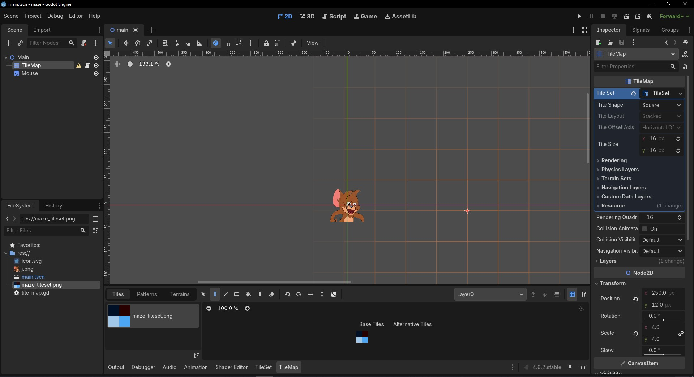
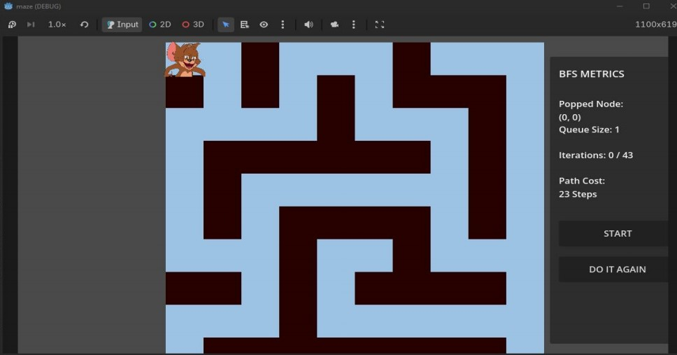
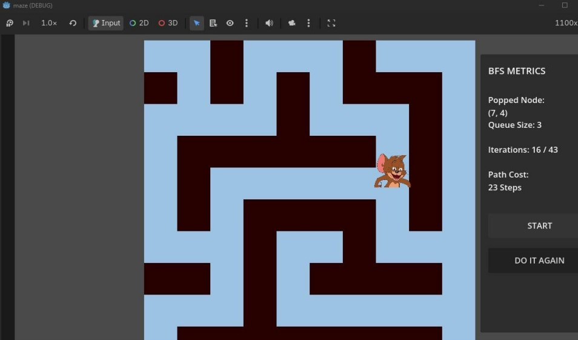
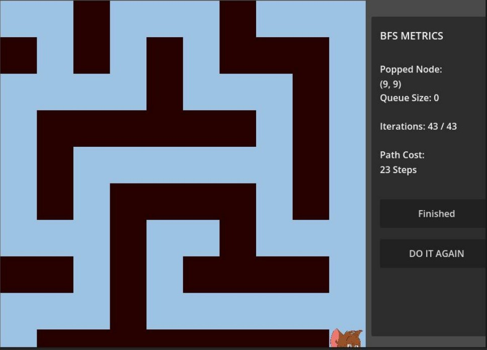

# Maze Runner BFS - Godot

A Breadth-First Search (BFS) maze solver developed using the Godot Engine. This project demonstrates shortest-path finding in a 2D maze while visualizing the BFS algorithm with real-time execution metrics.

---

## Project Overview

This project was developed as part of the Data Structures and Algorithms course. It implements the Breadth-First Search (BFS) algorithm to navigate a maze from a start node to a destination while displaying algorithm execution statistics.

---

## Features

- Breadth-First Search (BFS) pathfinding
- Automatic shortest path calculation
- Interactive Start/Stop simulation
- Reset simulation
- Real-time BFS metrics
- Queue size visualization
- Iteration counter
- Path cost calculation
- Built using Godot Engine

---

## Technologies Used

- Godot Engine 4.x
- GDScript
- Breadth-First Search (BFS)
- Data Structures & Algorithms

---

## Project Structure

```
Maze-Runner-BFS-Godot
│
├── source
├── report
├── assets
│   ├── screenshots
│   └── demo
├── README.md
└── LICENSE
```

---

## Screenshots

### Godot Workspace



### Simulation Start



### BFS Navigation



### Goal Reached



---

## How to Run

1. Install Godot Engine 4.x.
2. Clone or download this repository.
3. Open the **source** folder.
4. Import **project.godot** into Godot.
5. Run the project.

---

## Future Improvements

- A* Search implementation
- DFS comparison
- Random maze generation
- Multiple difficulty levels
- Animated path visualization

---

## Report

The complete project report is available in the **report** folder.

---

## Author

**Saman Saeed**

BS Computer Engineering

National University of Technology (NUTECH), Islamabad
